 INTERMODULAR DE DESARROLLO DE APLICACIONES WEB

**Stock for PYMEs**

- **Nombre del equipo:** equipo 7

- **Nombre de miembros [activos]{.underline}:** Claudia Andrea Morales Urribarri, Jimmy Estir Vergara Coronel, Kennys Eduardo Torres Belisario.

- **N.º de entregable**: Entregable 3

**[DESARROLLO DE APLICACIONES WEB]{.smallcaps}**

**MODALIDAD ONLINE**

**Índice**

**1. Introducción**

**2. Análisis Estratégico**

**2.1. Mapa de Ishikawa (Causa-Efecto)**

**2.2. Mapas de Experiencia: Presente vs. Futuro**

**3. Fase de Definición**

**3.1. Alcance y perímetro**

**3.2. Necesidad y Propuesta de Valor**

**3.3. Módulos Funcionales**

**4. Desarrollo Técnico y Core del Sistema**

**4.1. Búsqueda y Comparativa**

**4.2. Gestión e Infraestructura de Datos**

**5. Contexto Estratégico y Tendencias de Mercado**

**6. Organización y Recursos**

**6.1. Capacidad de Ejecución y Roles del Equipo**

**6.2. Estructura Organizativa**

**6.3. Recursos Software y Stack Tecnológico**

**7. Gestión del Proyecto**

**7.1. Metodología de Trabajo: Scrum**

**7.2. Plan de Comunicación (Interna y Externa)**

**7.3. Objetivos SMART y OKRs**

**7.4. Gestión de Dificultades y Soluciones**

**8. Planificación y Costes**

**8.1. Estimación de Costes**

**8.2. Planificación Temporal e Hitos**

**8.3. Actividades de Planificación (WBS y Tabla de Recursos)**

**8.4. Diagrama de Gantt**

**9. Modelo de Negocio**

**9.1. Business Model Canvas**

**10. Herramientas de Gestión y Desarrollo (Especificaciones)**

**10.1. Sistemas Operativos y Hardware**

**10.2. Seguridad y Control de Versiones**

**10.3. Lenguajes, Frameworks y SGBD (MySQL/PostgreSQL)**

**11. Diseño y Arquitectura (Diagramas UML)**

**11.1. Estructura del Producto (Clases, Componentes, Despliegue)**

**11.2. Funcionalidad del Producto (Casos de Uso, Actividad)**

**11.3. Estructura de la Base de Datos**

**12. Bibliografía**

**Introducción**

Esta plataforma es una solución integral de gestión de inventarios y visibilidad comercial diseñada específicamente para Pequeñas y Medianas Empresas (PYMEs). Bajo un modelo ROPO (*Research Online, Purchase Offline*), la aplicación permite a las empresas digitalizar su stock en tiempo real, mientras ofrece a los usuarios finales una interfaz intuitiva para localizar productos, comparar precios y especificaciones, y gestionar reservas garantizando una experiencia de compra eficiente y segura.

**Mapa de Ishikawa**
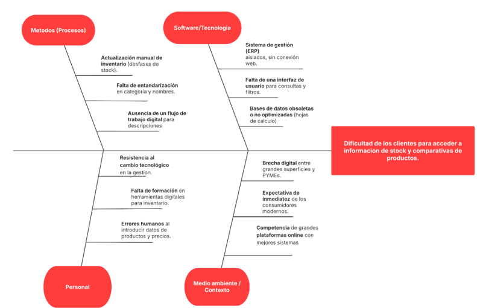

Se ha seleccionado el diagrama de Ishikawa (o causa-efecto) como herramienta de análisis debido a su capacidad para desglosar una problemática central en categorías multidimensionales (metodología, tecnología, personal y contexto). Dicho diagrama nos permite identificar no solo los síntomas del problema, sino las causas raíz que impiden la digitalización de las PYMEs. A partir de este análisis, se ha podido definir el alcance del proyecto y las funcionalidades críticas de la aplicación web.

Se eligió la comparativa de los mapas del presente y del futuro debido a que se puede visualizar los requisitos necesarios. Mientras el mapa del presente nos permite auditar los puntos de fallo en el flujo de datos actual de las PYMEs, el mapa del futuro define la arquitectura funcional que debe de tener la aplicación de tal manera que ese sea escalable y accesible desde cualquier dispositivo.

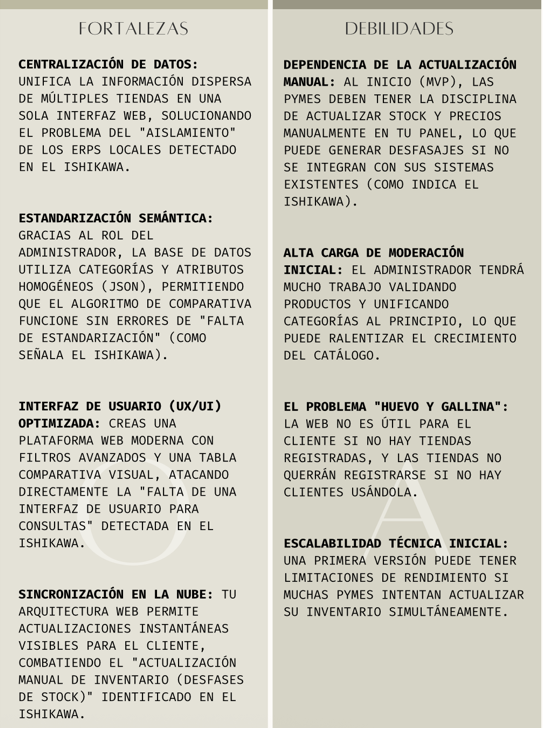

**Fase de Definición**

1. **Alcance y perímetro**

El proyecto Stock **for PYMEs** surge como respuesta a la brecha digital en el sector de farmacias de proximidad, operando en un entorno de competencia desigual frente a los gigantes del e-commerce. La solución se fundamenta en la tendencia ROPO (*Research Online, Purchase Offline*), permitiendo al usuario final mitigar la incertidumbre de stock y la dispersión de precios antes de realizar la compra física.

***Necesidad y Propuesta de Valor***

- Usuarios: Eliminación de la pérdida de energía y tiempo derivada de llamadas telefónicas y desplazamientos infructuosos. Se centraliza la información de múltiples farmacias en una única interfaz.

- PYMEs Farmacéuticas: Visibilidad digital inmediata y digitalización de inventarios sin los costes prohibitivos de desarrollar y mantener una plataforma propia.

##### *Módulos Funcionales* {#módulos-funcionales .unnumbered}

1. **Búsqueda y Comparación:** Implementación de filtros avanzados por categoría y nombre, generando tablas comparativas de precios y existencias en tiempo real.

2. **Conversión con Geolocalización:** Integración de APIs de mapas para la ubicación exacta de las tiendas y un sistema de reserva para asegurar la venta presencial.

3. **Panel de Gestión para Farmacias:** Herramienta de administración simplificada para la actualización instantánea de inventario.

4. **Infraestructura de Datos:** Diseño de una base de datos relacional normalizada para garantizar la integridad referencial y la escalabilidad del sistema.

#### *Mapas de Experiencia:*  {#mapas-de-experiencia .unnumbered}

#### Presente vs. Futuro {#presente-vs.-futuro .unnumbered}

El análisis mediante el Diagrama de Ishikawa nos ha permitido identificar las causas raíz de la ineficiencia actual para proyectar una arquitectura funcional optimizada.

| **Etapa** | **Acción del Cliente / Tienda** | **Punto de Dolor (Pain Point)** |
| --- | --- | --- |
| **Búsqueda** | Consulta en Google o redes sociales dispersas. | Información desactualizada o inexistente. |
| **Duda** | Llamadas telefónicas para confirmar stock/precio. | Saturación del personal en tienda y pérdida de tiempo del usuario. |
| **Comparativa** | Desplazamiento físico a 2 o 3 farmacias locales. | Gasto de combustible y alta probabilidad de abandono hacia Amazon. |
| **Gestión** | Registro manual de ventas (cuaderno o Excel aislado). | Desfase crítico entre el stock real y el anunciado. |

Mapa del Futuro (Beneficios)

| **Etapa** | **Acción con la Aplicación Web** | **Beneficio (Gain)** |
| --- | --- | --- |
| **Búsqueda** | Filtrado centralizado por categoría o nombre. | **Centralización:** El comercio local en un solo punto de acceso. |
| **Comparativa** | Visualización de tabla comparativa de stock y precios. | **Transparencia:** Decisión informada en segundos. |
| **Decisión** | Reserva de producto y visualización de geoposición. | **Conversión:** Incremento directo de ventas presenciales. |
| **Gestión** | Actualización instantánea en el panel de gestión. | **Automatización:** Digitalización de bajo coste y alta fidelidad. |

***Búsqueda y Comparativa***

Esta fase integra el Análisis de Requisitos (Tarea A: 15h) y el Desarrollo Frontend del Buscador (Tarea E: 35h). Se implementará una interfaz con filtros avanzados por Código Postal (CP), nombre de producto y categoría farmacéutica. El sistema generará tablas comparativas que garanticen la transparencia de precios, permitiendo al usuario una decisión de compra informada en milisegundos.

***Gestión e Infraestructura de Datos***

Representa el núcleo del sistema, abarcando el Diseño de la Base de Datos (Tarea B: 20h), el Diseño de Interfaz (Tarea C: 25h) y el Desarrollo del Backend (Tarea D: 40h).

Base de Datos Normalizada: Estructura relacional (MySQL/PostgreSQL) diseñada para mantener la integridad del stock.

Panel de Gestión: Lógica de backend para que la PYME actualice su inventario instantáneamente.

Dependencia Estructural: El desarrollo del backend (D) está sujeto a una dependencia Fin-Inicio con el diseño de la base de datos (B); no se iniciará la programación lógica sin una estructura de datos normalizada previa.

#### *Contexto Estratégico y Tendencias de Mercado* {#contexto-estratégico-y-tendencias-de-mercado .unnumbered}

El proyecto se sitúa en un entorno de competencia desigual frente a los gigantes del comercio electrónico. Para contrarrestar esto, nuestra estrategia se basa en los hallazgos del Diagrama de Ishikawa, el cual identifica que el aislamiento digital de las farmacias nace de \"Causas Raíz\" multidimensionales, destacando la resistencia al cambio tecnológico como la principal debilidad. Nuestra propuesta aprovecha la tendencia ROPO (*Research Online, Purchase Offline*), capitalizando la inmediatez y la confianza del asesoramiento farmacéutico local. Al utilizar fortalezas técnicas como una base de datos normalizada y una interfaz moderna, superaremos las carencias del sector, centrando el valor en la eliminación de la incertidumbre sobre el stock, factor crítico en productos de salud.

#### *Capacidad de Ejecución y Recursos* {#capacidad-de-ejecución-y-recursos .unnumbered}

La ejecución está liderada por el Equipo 7, con una distribución de roles que cubre el ciclo de vida completo del desarrollo:

- Claudia Andrea Morales Urribarri**:** Gestora de proyecto y especialista en desarrollo Frontend.

- Jimmy Estir Vergara Coronel: Arquitecto y diseñador de Base de Datos.

- Kennys Eduardo Torres Belisario: Desarrollador Senior Backend.

##### *Recursos Software y Stack Tecnológico* {#recursos-software-y-stack-tecnológico .unnumbered}

- Categoría: Herramienta / Tecnología.

- Comunicación Síncrona: Discord (Daily Meetings de 15 min).

- Gestión Documental: Google Drive (Minutas y Actas).

- Diseño y Arquitectura: Lucidchart (Diagramas de red y GANTT).

- Entorno de Desarrollo: VSCode.

- Gestión de Base de Datos: MySQL Workbench / PostgreSQL.

- Control de Versiones: Git / GitHub (Repositorio remoto).

- Stack de Desarrollo: React/Angular (Frontend), Node.js (Backend).

- Planificación Temporal: GanttProject.

#### *Estimación de Costes* {#estimación-de-costes .unnumbered}

La inversión se desglosa bajo el siguiente modelo de costes:

- Costes Internos: Esfuerzo humano del equipo de desarrollo. Se imputan 10 horas de dedicación específica para la presente fase de definición y un total de 180 horas para la ejecución técnica completa, repartidas equitativamente entre los tres miembros del equipo 7.

- Costes Externos: Gastos operativos derivados del despliegue en servidores web y el consumo de créditos en APIs de geolocalización. El diseño busca minimizar estos costes para asegurar una solución accesible para la farmacia local.

#### *Planificación Temporal e Hitos* {#planificación-temporal-e-hitos .unnumbered}

El cronograma del proyecto está regido por una fecha de entrega inamovible: 8 de abril de 2026. Hitos y Dependencias Críticas:

1. Cierre de Fase de Definición (Hito Actual): 08/04/2026 (Planificación base).

2. Diseño Técnico (A → B, C): Inicio de arquitectura tras aprobación de requisitos.

3. Hito de Desarrollo Core (B → D): Programación de backend supeditada a la normalización de datos.

4. Integración Frontend-Conversión (E+F G): Sincronización final de buscador y geoposicionamiento.

5. Entrega Final y Despliegue: Finalización de la materia en el 4to trimestre. Utilizaremos la metodología Scrum para gestionar este calendario. Este marco de desarrollo incremental nos permite realizar entregas parciales utilizables al final de cada sprint, asegurando la adaptabilidad ante la resistencia al cambio detectada en el análisis estratégico.

6. **Actividades de planificación**

***Tabla de Recursos***

| Tarea | Recursos Humanos (Equipo 7) | Recursos Hardware | Recursos Software | Coste |
| --- | --- | --- | --- | --- |
| **Análisis de Requisitos y Definición** | Claudia, Jimmy, Kennys | PCs personales | Documentación, Discord | Interno (Tiempo) |
| **Diseño de Base de Datos Normalizada** | Jimmy E. Vergara | PCs personales | Lucidchart, MySQL/PostgreSQL | Interno |
| **Desarrollo del Frontend (Buscador/Filtros)** | Claudia A. Morales | PCs personales | React/Angular, CSS | Interno |
| **Desarrollo del Backend (Panel PYME)** | Kennys E. Torres | PCs personales | Node.js / PHP / Python | Interno |
| **Integración de Reservas y Geoposición** | Equipo 7 | PCs personales | API Mapas, Servidor Web | Interno/Externo |
| **Pruebas de Validación y Ajustes** | Equipo 7 | Dispositivos móviles | Navegadores, Herramientas QA | Interno |

***Lista de Tareas del Proyecto (WBS)***

| **ID** | **Tarea** | **Duración Estimada (Horas)** | **Descripción Basada en el Proyecto** |
| --- | --- | --- | --- |
| **A** | **Análisis de Requisitos** | 15h | Identificación de puntos de dolor (información desactualizada) y beneficios (centralización). |
| **B** | **Diseño de Base de Datos** | 20h | Creación de la estructura normalizada para gestionar stock y precios en tiempo real. |
| **C** | **Diseño de Interfaz (UI/UX)** | 25h | Diseño de la interfaz web moderna para el comparador y el panel de la PYME. |
| **D** | **Desarrollo Backend (Panel PYME)** | 40h | Programación de la lógica de actualización instantánea y gestión de inventario. |
| **E** | **Desarrollo Frontend (Buscador)** | 35h | Implementación de filtros por categoría/nombre y la tabla comparativa transparente. |
| **F** | **Módulo de Geoposición y Reservas** | 20h | Integración de mapas para ubicación física y sistema de reserva de productos. |
| **G** | **Pruebas de Integración y QA** | 15h | Validación de la funcionalidad total y corrección de errores críticos. |
| **H** | **Despliegue y Entrega Final** | 10h | Puesta en producción y documentación final para el usuario/PYME. |

***Diagrama de Gantt***

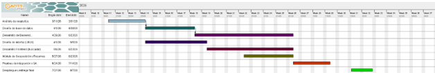)

1. **Participantes y roles del equipo de proyecto**

##### *Estructura Organizativa* {#estructura-organizativa .unnumbered}

- Claudia Andrea Morales Urribarri (Gestora): Responsable de la moderación de sesiones, control de hitos y desarrollo de la interfaz de usuario móvil.

- Jimmy E. Vergara (Especialista en Datos): responsable del diseño técnico, normalización de la DB y gestión del servidor MySQL.

- Kennys E. Torres (Especialista Backend): Encargado de la lógica de actualización instantánea y la integración de servicios de geolocalización.

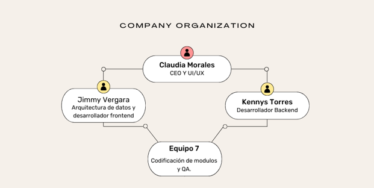

##### Metodología de Trabajo: Scrum

Se ha seleccionado Scrum como marco de trabajo por su naturaleza de desarrollo incremental e iterativo, esencial para la adaptabilidad estratégica en entornos farmacéuticos dinámicos.

- Sprints**:** Ciclos de 2 a 4 semanas con entregas parciales utilizables.

- Inspección y Adaptación: Uso de Daily Meetings de 15 minutos para tratar bloqueos

La elección de esta metodología responde a la necesidad de adaptabilidad estratégica. Al operar en entornos dinámicos, Scrum facilita la identificación y resolución de \"puntos de dolor\" no previstos inicialmente, permitiendo reaccionar ante cambios en los requerimientos mediante la inspección y adaptación constante, sin comprometer la viabilidad técnica ni el cronograma general del proyecto.

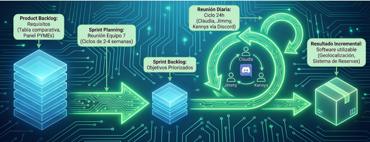

1. **Plan de comunicación**

***Plan de comunicación interna:***

Canales Síncronos (Reuniones en tiempo real):

- Herramienta: Discord.

- Frecuencia: Reuniones diarias de 15 minutos (Daily Meetings) siguiendo la metodología Scrum para tratar bloqueos y avances del día.

- Responsable: Claudia Andrea Morales (Gestora) convoca y modera las sesiones

Canales Asíncronos (Gestión de archivos y documentación):

- Herramienta: GitHub.

- Uso: Almacenamiento del informe final, diagramas de Lucidchart y la minuta de trabajo grupal. Cada miembro es responsable de actualizar su carpeta de especialidad.

***Plan de comunicación externa:***

Canal Principal: Aula Virtual (Plataforma IFP).

- Uso: Es el centro oficial para la entrega de tareas y la recepción de feedback del tutor.

- Evidencias: Se publicarán en el aula virtual capturas de pantalla de las interacciones en Discord y enlaces a los documentos en Drive como prueba del trabajo colaborativo.

Canal de Consultas: Mensajería interna de la plataforma para dudas que afecten a la evaluación o requisitos técnicos del módulo.

| Medio / Herramienta | Tipo de Comunicación | Finalidad en "Stock for PYMEs" |
| --- | --- | --- |
| Discord | Interna / Síncrona | Coordinación técnica y toma de decisiones rápida. |
| GitHub | Interna / Asíncrona | Repositorio central de documentación y control de versiones. |
| Lucidchart | Interna / Técnica | Diseño de diagramas de red de tareas y organigramas. |
| Aula Virtual | Externa / Formal | Entrega de hitos, evidencias de trabajo y tutorías. |

#### Objetivos SMART y/o OKRs

***Objetivos SMART***

Objetivo de Funcionalidad (Producto)

1. **S (Específico):** Desarrollar un buscador web centralizado que permita filtrar productos por categoría y nombre, mostrando una tabla comparativa con stock real y precios de tiendas locales.

2. **M (Medible):** El sistema debe mostrar resultados de al menos 3 comercios diferentes por cada búsqueda realizada.

3. **A (Alcanzable):** El equipo cuenta con especialistas en Frontend y una base de datos normalizada para gestionar esta información.

4. **R (Relevante):** Resuelve el \"punto de dolor\" de la información dispersa y desactualizada identificada en el mapa del presente.

5. **T (Tiempo):** El módulo de búsqueda y comparativa debe estar 100% funcional para la fase de pruebas de integración.

Objetivo de Mercado (Sector Estratégico)

1. **S (Específico):** Implementar un programa piloto enfocado en el **sector farmacéutico** local para validar la utilidad del comparador de precios y stock.

2. **M (Medible):** Lograr que al menos **5 farmacias locales** actualicen su inventario diariamente a través del panel de gestión.

3. **A (Alcanzable):** Se aprovecha la alta variabilidad de precios y la duda crítica de stock en este sector para atraer a los primeros usuarios.

4. **R (Relevante):** Alineado con el beneficio de **transparencia** y la tendencia de consumo ROPO.

5. **T (Tiempo):** Alcanzar esta meta en los primeros 30 días tras el lanzamiento de la versión beta.

Objetivo de Calidad Técnica (Gestión)

- **S (Específico):** Garantizar la sincronización instantánea de datos entre el panel de la PYME y la interfaz pública del cliente.

- **M (Medible):** Mantener un margen de error menor al **1%** en la veracidad del stock mostrado frente al stock físico de la tienda.

- **A (Alcanzable):** Mediante una arquitectura funcional escalable y el uso de herramientas de automatización en el panel de la PYME.

- **R (Relevante):** Evita que el cliente se desplace físicamente de forma inútil, eliminando una de las causas raíz detectadas en el diagrama de Ishikawa.

- **T (Tiempo):** Este estándar de calidad debe validarse durante todo el proceso de pruebas unitarias y de validación.

***7. Gestión de Dificultades y Soluciones***

Dificultad Identificada, Solución Estratégica / Técnica

Resistencia a la digitalización: Brecha tecnológica en farmacéuticos tradicionales. Diseño de un panel de gestión minimalista de \"\"curva de aprendizaje cero.

Desfase de datos crítico: Venta física no reflejada en la web. Sistema de validación en el momento de la reserva con actualización instantánea de la DB.

Competencia de grandes plataformas: Dominio de gigantes online. Enfoque exclusivo en la proximidad (ROPO) y la inmediatez de productos de salud urgentes.

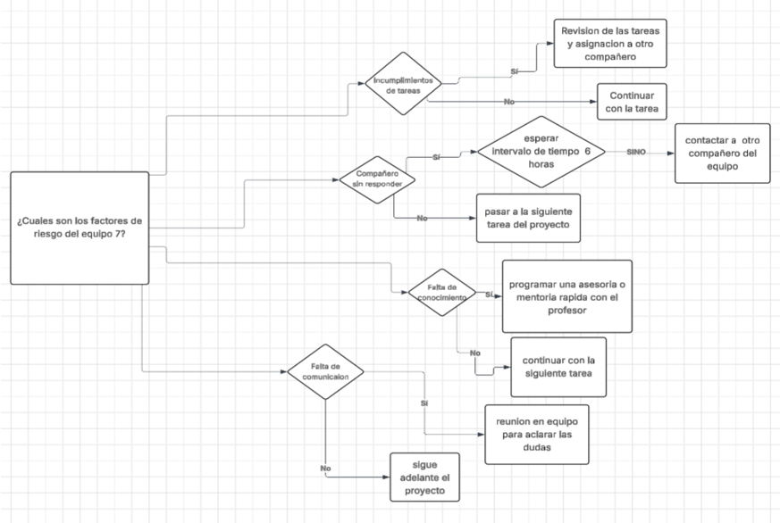

***8. Business Model Canvas***

- Propuesta de Valor: Ahorro de tiempo/energía para el usuario y visibilidad digital de bajo coste para la farmacia local, atacando la incertidumbre de stock.

- Segmentos de Cliente: 1. Usuario final con necesidades de salud inmediatas. 2. PYMEs farmacéuticas que requieren digitalización accesible.

- Canales: Aplicación Web optimizada para móviles con geoposicionamiento.

- Relación con Clientes: Autoservicio automatizado para farmacias y transparencia total para el comprador.

- Fuentes de Ingresos: Suscripciones mínimas para comercios o modelos de comisión por reserva gestionada.

- Actividades Clave: Mantenimiento del comparador y optimización de la integridad de los datos de stock.

- Recursos Clave: Desarrolladores (Equipo 7), base de datos normalizada y APIs de mapas.

- Socios Clave: Colegios de farmacéuticos locales y proveedores de servicios cloud de bajo coste.

- Estructura de Costes: Tiempo de desarrollo del equipo y costes marginales de despliegue en servidor.

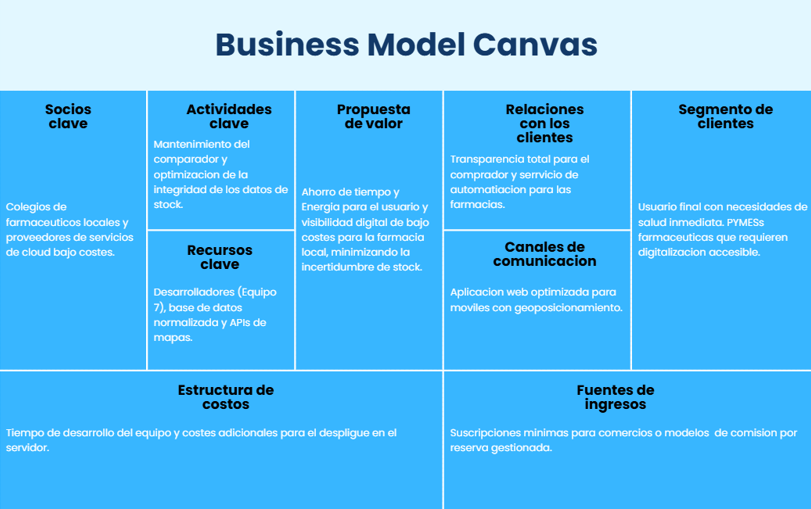

Herramientas de Gestión y Desarrollo

**a. Sistemas Operativos y Configuración de Base**

- **Cliente:** Se utilizarán PCs personales con sistemas operativos Windows 10/11 o macOS, ya que permiten la ejecución fluida de los entornos de desarrollo modernos (IDE) y navegadores web para pruebas.

- **Servidor:** Para la explotación del sistema, se prevé el uso de Linux (distribución Ubuntu o Debian) en servidores web, debido a su estabilidad, seguridad y compatibilidad nativa con el stack de Node.js.

**b. Información del Sistema (Hardware)**

- **Equipo Cliente:** Ordenadores con al menos 8GB de RAM y procesadores multinúcleo para soportar la ejecución simultánea de VSCode, contenedores locales y múltiples pestañas de navegador para depuración.

- **Equipo Servidor:** Infraestructura en la nube (Cloud Hosting) con capacidad de escalabilidad para manejar la base de datos relacional y las peticiones concurrentes de las PYMEs farmacéuticas.

**c. Acceso a Dominios y Seguridad**

- **Administración:** El acceso a los entornos de desarrollo y producción se gestionará mediante protocolos SSH y autenticación de dos factores (2FA) donde sea posible.

- **Seguridad:** Se implementarán certificados SSL/TLS para garantizar conexiones HTTPS seguras, protegiendo la integridad de los datos de stock y precios. Las condiciones de registro se limitarán a personal autorizado del equipo 7 y farmacias validadas.

**d. Lenguajes de Programación**

- **Frontend:** Uso de JavaScript/TypeScript para el desarrollo de interfaces dinámicas.

- **Backend:** JavaScript ejecutado en el entorno de Node.js, permitiendo una lógica de servidor asíncrona y eficiente.

**e. Sistema de Control de Versiones**

- **Herramienta:** Se ha seleccionado Git para el control de versiones local.

- **Repositorio Remoto:** El proyecto se centralizará en GitHub, que servirá como repositorio oficial para el intercambio de código entre Claudia, Jimmy y Kennys.

**f. Instalación de Software Específico**

- **Entorno de Desarrollo (IDE**): VSCode como editor principal.

- **Ofimática y Documentación:** Google Drive para la gestión de minutas, actas y el informe final.

- **Diseño Técnico:** Lucidchart para diagramas UML (clases, componentes, despliegue) y GanttProject para la planificación temporal.

- **Comunicación:** Discord para las reuniones diarias (*Daily Meetings*) de 15 minutos.

**g. Sistema Gestor de Bases de Datos (SGBD)**

- Se utilizará un SGBD Relacional, seleccionando específicamente MySQL o PostgreSQL.

- **Justificación:** Esta elección garantiza la normalización de datos y la integridad referencial necesaria para que el stock de las farmacias se refleje sin errores de sincronización. Se usará MySQL Workbench para la administración de las tablas.

**h. Valoración de Frameworks**

- **Frontend:** Se utilizará React. Esta librería permite agilizar la implementación algorítmica de los filtros de búsqueda y la tabla comparativa mediante componentes reutilizables, asegurando una interfaz web moderna y escalable.

- **Backend:** El uso de frameworks como Express.js (dentro de Node.js) facilitará la creación de APIs para la integración de mapas y el sistema de reservas.

Esta configuración tecnológica asegurase que el producto sea funcional, seguro y cumpla con los estándares requeridos para la digitalización del sector farmacéutico local.

Estructura del Producto

*Diagrama de Clases UML*
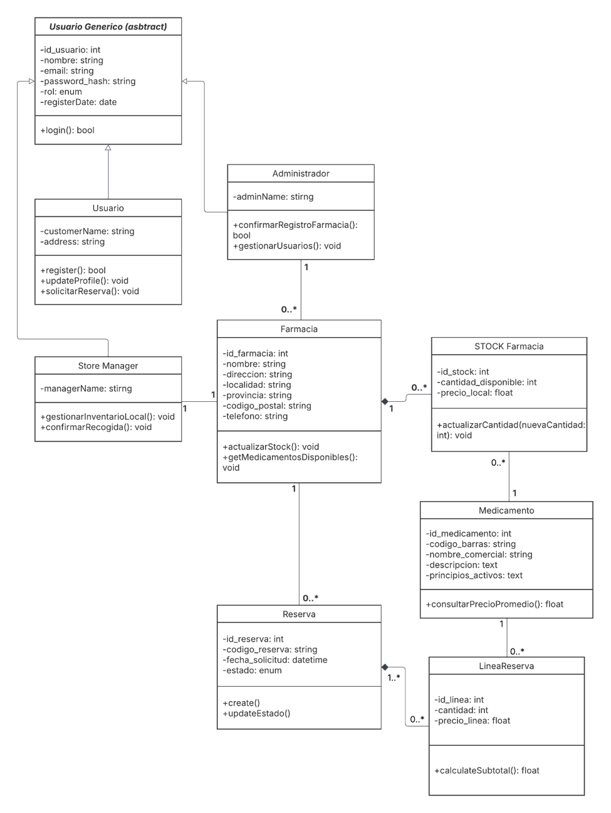

*Diagrama de Componentes UML*

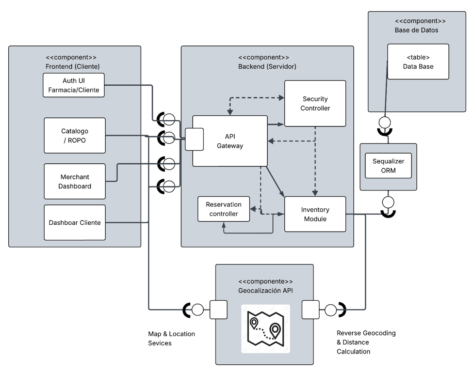
Funcionalidad del Producto

*Diagrama de Despliegue*

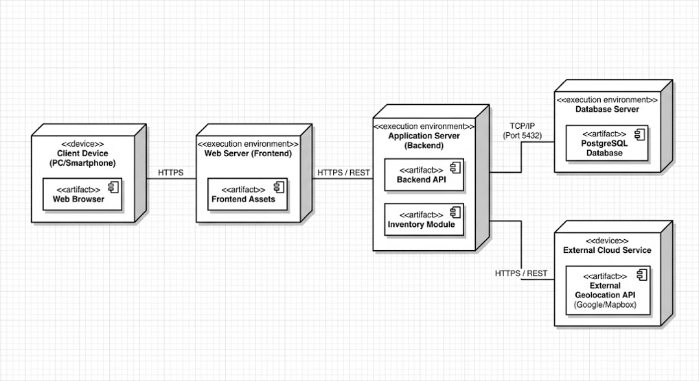

Funcionalidad del Producto

*Diagrama de Casos de Uso*

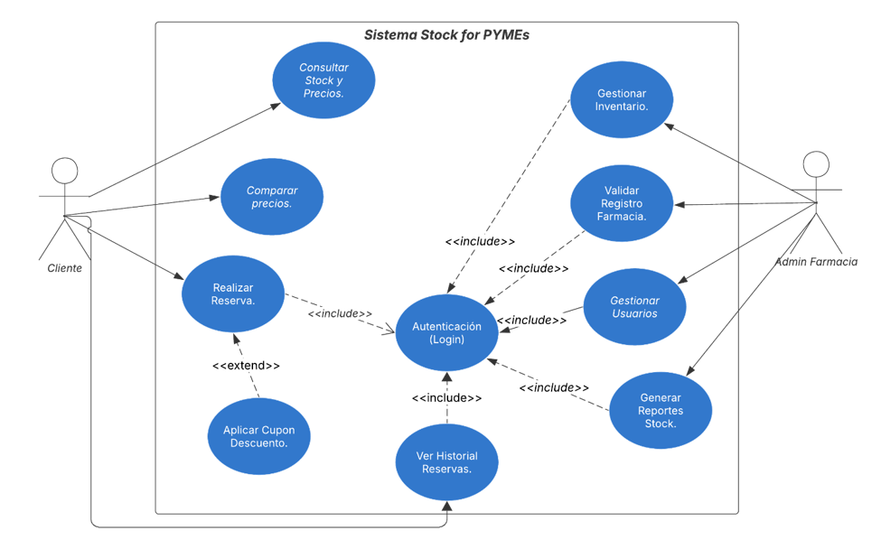

*Diagrama de Actividad*

Procesos de reserva de medicamentos.

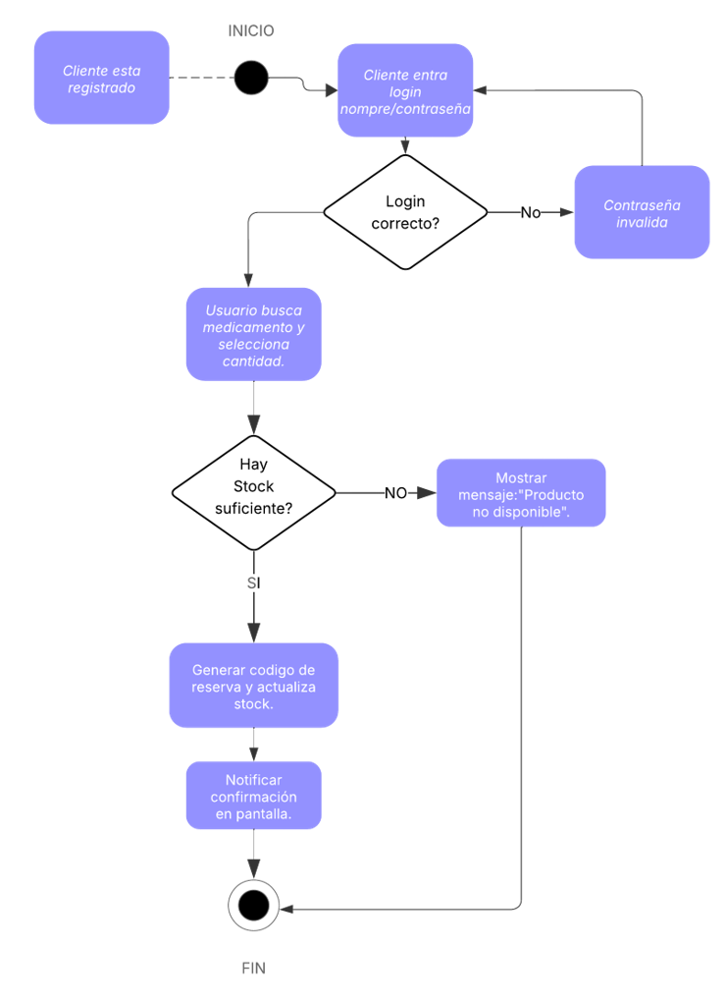

Estructura de la Base de Datos

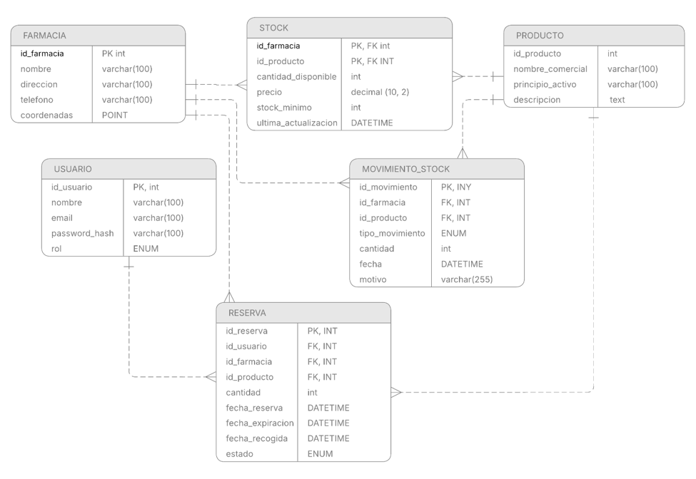

**Bibliografía**.

**Libros**

Centro de Estudios CEAC. (2018). Proyecto de desarrollo de aplicaciones web (2ª ed.). Planeta De Agostini Formación.

Lozano, M. Á., & Sota, A. (Colab.). (2018). Desarrollo de aplicaciones web. Centro de Estudios CEAC.

Brown, T. (2009). Change by design: How design thinking creates new alternatives for business and society. HarperBusiness.

Humphrey, A. (2005). SWOT analysis for management consulting. SRI International.

Ishikawa, K. (1986). Guide to quality control. Asian Productivity Organization.

**Metodologías y herramientas**

Discord Inc. (2026). Discord \[Software\]. <https://discord.com>

Google. (2026). Google Drive \[Software\]. <https://drive.google.com>

Lucid Software Inc. (2026). Lucidchart \[Software\]. <https://lucidchart.com>

**Material docente**

Cerro, J. P. (2026). Guías y materiales de la asignatura proporcionados en la plataforma MiProfesor. Material docente no publicado.
